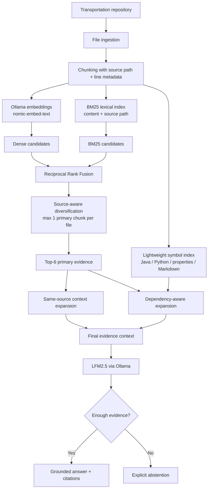

# Transportation Research Assistant

A fully local, experimentally evaluated Retrieval-Augmented Generation (RAG) assistant for technical question answering over a transportation-simulation codebase.

The project indexes [`RookBytes/porto-route-simulation`](https://github.com/RookBytes/porto-route-simulation) and answers questions about preprocessing, route choice, rerouting, traffic physics, objective metrics, experiment design, and implementation details with explicit source citations.

The final system combines a strong conventional hybrid retriever with **dependency-aware post-retrieval evidence expansion**. A key experimental finding was that using code-structure signals to expand evidence **after** retrieval worked better for multi-file questions than injecting symbol-aware signals directly into the initial ranking.

---

## Final Result

On a **frozen 40-question multi-hop held-out benchmark** containing 30 answerable questions and 10 deliberately unsupported questions, the final V4 system achieved:

| Metric | Final V4 held-out |
|---|---:|
| Recall@1 | **63.33%** |
| Recall@3 | **100.00%** |
| Recall@5 | **100.00%** |
| MRR | **0.8056** |
| Gold-source coverage in primary top-5 | **65.00%** |
| Gold-source coverage in final generation context | **83.06%** |
| Complete gold evidence chain in primary top-5 | **26.67%** |
| Complete gold evidence chain in final context | **60.00%** |
| Abstention accuracy | **97.50%** |
| Citation validity | **100.00%** |
| Local-judge expected-fact coverage | **95.83%** |
| Mean answer latency | **10.31 s** |

Dependency-aware expansion increased complete multi-file evidence recovery from **8/30 questions to 18/30 questions** on the final held-out set.

That is a **+33.3 percentage-point absolute gain** in complete evidence-chain recovery after the initial retriever had already run.

---

## Highlights

- Fully local generation with **LFM2.5 via Ollama**
- Local embeddings with **`nomic-embed-text`**
- Dense semantic retrieval + dependency-free **BM25**
- Fielded lexical scoring over chunk content and source paths
- **Reciprocal Rank Fusion (RRF)**
- Source-aware primary-result diversification
- Same-source context expansion
- Lightweight code/document symbol extraction
- **Dependency-aware cross-file evidence expansion**
- Inline source citations such as `[S1]`
- Explicit abstention for unsupported questions
- Retrieval, multi-source context, abstention, citation, latency, and expected-fact evaluation
- Separate development and held-out benchmarks
- **216-config retrieval tuning sweep**
- Local LLM reranker tested and rejected
- Symbol-aware initial ranking tested and rejected after ablation
- Final architecture selected by measured evidence rather than architectural complexity

---

## Why this project?

Many RAG demos demonstrate that an LLM can answer a few questions from documents.

This project instead treats RAG as an **information-retrieval and evidence-assembly system that must be measured**.

Typical questions include:

- How does inferred background congestion reach the Java edge-cost calculation?
- How does a rerouting threshold move from configuration into a runtime decision?
- Which files participate in realized-route classification?
- How is a route-learning state update connected to later route choice?
- How are objective metrics computed from observed and simulated routes?
- Which configuration and sweep logic produced an experiment?
- When should the assistant refuse to answer?

Some questions require one source. Harder questions require a chain such as:

```text
preprocessing documentation
        ↓
DataRepository.java
        ↓
SimulationEngine.java
        ↓
objective / route-choice logic
```

The system is therefore evaluated not only on whether it retrieves **one relevant file**, but also on whether it assembles the **complete set of required source files** for a multi-hop answer.

---

## Final Architecture



### Final retrieval mode

The final V4 retriever is:

```text
hybrid_dependency
```

Its behavior is deliberately asymmetric:

```text
INITIAL RANKING
Dense + BM25/path
        ↓
RRF
        ↓
source diversification

CONTEXT ASSEMBLY
primary evidence
        ├── more chunks from already-selected files
        └── dependency-linked definition chunks from other files
```

The structural layer is therefore used for **post-retrieval evidence expansion**, not for first-stage ranking.

---

## Final Retrieval Configuration

| Setting | Value |
|---|---:|
| Source-path BM25 weight | `1.0` |
| Hybrid candidate count | `10` |
| RRF constant | `20` |
| Primary chunks per source | `1` |
| Primary context | Top `6` chunks |
| Embedding model | `nomic-embed-text` |
| Generation model | `lfm2.5` |
| Runtime | Ollama |
| Final retrieval mode | `hybrid_dependency` |

The hybrid retrieval settings were selected on the original development benchmark before held-out evaluation.

---

# Retrieval Pipeline

## 1. Dense retrieval

Each chunk is embedded locally using `nomic-embed-text`.

The persisted embedding matrix is searched using cosine similarity.

Dense retrieval is useful for conceptual matches where query wording differs from the repository text.

---

## 2. BM25 lexical retrieval

A local BM25 implementation provides an independent lexical signal.

BM25 operates over:

- chunk text;
- source path.

Source-path weighting is especially useful for technical questions containing class names, configuration fields, scripts, or filenames.

---

## 3. Reciprocal Rank Fusion

Dense and BM25 rankings are merged with Reciprocal Rank Fusion:

\[
\mathrm{RRF}(d)=\sum_r \frac{1}{k+\mathrm{rank}_r(d)}
\]

The tuned RRF constant is:

```text
k = 20
```

This hybrid stage substantially outperformed the original dense-only baseline.

---

## 4. Source-aware diversification

Primary retrieval keeps at most one chunk from each source file.

Without diversification, several chunks from one large file can occupy most of the top-K positions.

The goal is to maximize **source coverage first**.

This creates a new problem, however: one chunk from the correct file may not contain enough local evidence to answer the question.

That led to the next stage.

---

## 5. Same-source context expansion

V2.3 separated **primary retrieval** from **generation context**.

After the diversified top results are selected, the system can append additional high-ranked chunks from files already represented in the primary set.

This preserves diverse file discovery while supplying more local implementation context.

---

## 6. Lightweight structural index

V4 adds lightweight symbol extraction without requiring Tree-sitter or another model.

The structural index heuristically extracts:

- Java types, methods, and fields;
- Python classes and functions;
- properties/configuration keys;
- compact Markdown headings.

This is intentionally **not a compiler-grade AST**.

The goal is to build a cheap local structural signal over the same persisted chunks.

---

## 7. Dependency-aware evidence expansion

The structural index is used to build lightweight cross-chunk dependency links.

Nodes are indexed chunks containing definitions.

Edges arise when:

- the query names a known symbol; or
- an already-selected chunk mentions an identifier that is defined in another chunk.

The final system follows these links after normal hybrid retrieval and can introduce additional source files into the generation context.

This is the main V4 contribution.

Importantly, dependency expansion is conservative: it follows known symbol-definition links rather than adding arbitrary lexical neighbors.

---

# Grounded Generation

The generator receives evidence using explicit source identifiers:

```text
[S1] simulation/src/main/java/porto/sweep/sim/SimulationEngine.java:...
...

[S2] simulation/src/main/java/porto/sweep/io/DataRepository.java:...
...
```

The model is instructed to answer from the provided evidence and cite supporting sources.

If the evidence is insufficient, it returns the exact abstention response:

```text
I don't have enough evidence in the indexed sources to answer that reliably.
```

Abstention is evaluated explicitly.

---

# Evaluation Methodology

The project evolved through several benchmarks rather than using one dataset repeatedly for everything.

## Benchmark 1 — Original development set

```text
50 questions
├── 40 answerable
└── 10 unanswerable
```

This benchmark was used to develop V1 through V2.3.

It was used for:

- dense-baseline measurement;
- hybrid-retrieval development;
- failure analysis;
- BM25 source-path weighting;
- source diversification;
- a 216-configuration retrieval sweep;
- same-source context expansion;
- evaluator robustness work.

Because it was used for model selection and tuning, it is reported as a **development benchmark**.

---

## Benchmark 2 — V2.3 held-out set

After V2.3 was frozen, a separate 50-question benchmark was created:

```text
50 questions
├── 40 answerable
└── 10 unanswerable
```

No V2.3 retrieval or generation settings were tuned against its result.

This benchmark established the final performance of the conventional hybrid RAG system before the multi-hop V4 work.

---

## Benchmark 3 — V4 multi-hop development set

A harder development benchmark was then created specifically to test cross-file reasoning:

```text
25 questions
├── 20 answerable multi-source questions
└── 5 unanswerable questions
```

Every answerable question requires at least two gold source files.

This benchmark was used to compare:

```text
A: hybrid
   V2.3 hybrid ranking
   + same-source expansion

B: hybrid_dependency
   V2.3 hybrid ranking
   + same-source expansion
   + dependency expansion

C: code_hybrid
   symbol-aware initial ranking
   + same-source expansion
   + dependency expansion
```

This benchmark is development data and is not the final V4 result.

---

## Benchmark 4 — V4 multi-hop held-out set

After `hybrid_dependency` was selected and frozen, a new benchmark was created:

```text
40 questions
├── 30 answerable multi-hop questions
└── 10 unanswerable questions
```

The answerable questions require:

```text
7 questions  → 2 gold source files
21 questions → 3 gold source files
2 questions  → 4 gold source files
```

The benchmark was tied to a repository snapshot:

```text
Repository: RookBytes/porto-route-simulation
Branch: main
Commit: b96411d88e62921abd199e20e026e3cbeac07844
```

No retrieval, dependency-expansion, prompting, generation, abstention, or judge behavior was tuned using the final V4 held-out result.

---

# Evaluation Metrics

## Recall@K

For answerable questions, Recall@K asks:

> Is at least one annotated gold source file present within the first K primary retrieval results?

This metric is useful for ordinary retrieval, but it becomes weak for multi-hop questions because retrieving one of three required files is counted as success.

---

## Mean Reciprocal Rank

\[
\mathrm{MRR} =
\frac{1}{N}
\sum_{i=1}^{N}
\frac{1}{\mathrm{rank}_i}
\]

MRR measures how early the first gold source tends to appear.

---

## Gold-source coverage@K

For multi-source questions:

\[
\mathrm{coverage@K}
=
\frac{\text{number of required gold source files retrieved in top K}}
{\text{number of required gold source files}}
\]

Example:

```text
Gold sources:
A.java
B.java
C.java

Top-3 retrieval:
A.java
README.md
C.java

Gold-source coverage@3 = 2/3 = 66.7%
```

---

## All-gold-sources recall

This is the strict multi-hop metric.

A question scores `1` only if **every required gold source file** is present.

For example:

```text
A.java ✓
B.java ✓
C.java ✗

all-gold-sources = 0
```

This makes the metric much harder than ordinary Recall@K.

---

## Final-context gold-source coverage

Primary retrieval is not necessarily the evidence ultimately sent to the generator.

The evaluator therefore also scores the expanded context after:

- same-source context expansion;
- dependency-aware cross-file expansion.

The two main V4 retrieval metrics are:

```text
mean_gold_source_coverage_in_context
all_gold_sources_recall_in_context
```

These directly measure whether V4 assembled the evidence chain the generator actually receives.

---

## Abstention accuracy

The evaluator checks whether:

- answerable questions are answered;
- unsupported questions are refused.

Answerable abstentions count as errors.

---

## Citation validity

Citation validity verifies that generated source IDs such as `[S1]` refer to evidence actually supplied to the model.

It does **not** prove semantic entailment between every claim and its cited passage.

---

## Expected-fact coverage

Each answerable benchmark question contains explicit expected facts.

A local Ollama judge marks whether each expected fact is substantively present in the answer.

Answerable abstentions receive zero coverage.

The judge:

- runs at temperature `0`;
- normalizes several valid Boolean JSON forms;
- retries malformed batch outputs;
- falls back to one-fact-at-a-time grading when necessary;
- reports parse failures rather than silently excluding them.

This metric is reported as:

> **local-judge expected-fact coverage**

It is not presented as independent human accuracy because the judge is another local model.

---

## Latency

The evaluator records local answer-generation latency.

Judge time is not included in the answer-latency metric.

Latency should be interpreted as an observed hardware/runtime measurement, not as a platform-independent benchmark.

---

# Experimental Results

## V1 → V2.3 development trajectory

| Version | Retrieval design | Recall@1 | Recall@3 | Recall@5 | MRR | Abstention |
|---|---|---:|---:|---:|---:|---:|
| V1 | Dense only | 57.5% | 72.5% | 85.0% | 0.676 | 78% |
| V2 | Dense + BM25 + RRF | 65.0% | 92.5% | 92.5% | 0.779 | 86% |
| V2.2 | Tuned hybrid retrieval | 67.5% | 92.5% | 95.0% | 0.810 | 82% |
| V2.3 | Tuned hybrid + same-source context expansion | **67.5%** | **92.5%** | **95.0%** | **0.810** | **94%** |

Final V2.3 development generation metrics:

| Metric | Result |
|---|---:|
| Citation validity | 100% |
| Local-judge expected-fact coverage | 88.13% |
| Mean answer latency | 6.76 s |

---

## V2.3 frozen held-out result

| Metric | Result |
|---|---:|
| Recall@1 | **77.5%** |
| Recall@3 | **95.0%** |
| Recall@5 | **100.0%** |
| MRR | **0.8708** |
| Abstention accuracy | **98.0%** |
| Citation validity | **100.0%** |
| Local-judge expected-fact coverage | **96.04%** |
| Mean answer latency | 8.50 s |

For the 40 answerable questions:

```text
Gold source at rank 1      31 / 40
Gold source within top 3   38 / 40
Gold source within top 5   40 / 40
```

Abstention behavior:

```text
40 answerable
├── 39 answered
└── 1 false abstention

10 unanswerable
└── 10 correctly abstained

Overall abstention accuracy: 49 / 50 = 98%
```

This established that V2.3 was already strong for mostly single-source technical QA.

---

# V4: Multi-Hop Evidence Retrieval

The next research question was:

> Can repository structure help the system assemble complete evidence chains across multiple files?

A 25-question multi-hop development set exposed a weakness hidden by ordinary Recall@K.

With conventional hybrid retrieval:

```text
Recall@5 = 100%
```

yet:

```text
All required gold files in primary top-5 = 25%
```

The retriever nearly always found **something relevant**, but often did not recover the complete evidence chain.

---

## Experiment: symbol-aware initial ranking

V4 first added lightweight symbol-aware ranking on top of the hybrid retriever.

This produced only small improvements in early ranking.

On the multi-hop development set:

| Metric | Hybrid | Code-hybrid |
|---|---:|---:|
| Recall@1 | 45.0% | **50.0%** |
| Recall@3 | 80.0% | 80.0% |
| Recall@5 | 100% | 100% |
| MRR | 0.650 | **0.673** |
| Gold-source coverage@5 | 69.17% | 69.17% |
| All gold sources@5 | 25% | 25% |

The symbol layer mostly reordered files that were already discoverable.

It did not solve the full-chain problem by itself.

---

## Dependency-aware context expansion

When dependency expansion was measured on the **actual final context**, the structural layer showed a meaningful effect.

| Metric | Hybrid | Symbol + dependency |
|---|---:|---:|
| Final-context gold coverage | 72.08% | **78.33%** |
| Complete chain in context | 30% | **45%** |
| Mean unique context sources | 5.85 | 7.80 |
| Local-judge fact coverage | 95.83% | **97.08%** |

This showed that repository structure was useful primarily during evidence assembly.

---

# V4 Ablation

A final ablation isolated dependency expansion from symbol-aware initial ranking.

### A — Hybrid

```text
V2.3 hybrid ranking
+ same-source context expansion
```

### B — Hybrid + dependency

```text
V2.3 hybrid ranking
+ same-source expansion
+ dependency-aware cross-file expansion
```

### C — Symbol + dependency

```text
symbol-aware ranking
+ same-source expansion
+ dependency-aware cross-file expansion
```

Results:

| Metric | A: Hybrid | **B: Hybrid + dependency** | C: Symbol + dependency |
|---|---:|---:|---:|
| Recall@1 | 45.0% | 45.0% | **50.0%** |
| MRR | 0.650 | 0.650 | **0.673** |
| Final-context gold coverage | 72.08% | **80.00%** | 78.33% |
| Complete chain in context | 30% | **50%** | 45% |
| Mean unique context sources | 5.85 | 7.75 | 7.80 |
| Abstention accuracy | 100% | **100%** | 100% |
| Citation validity | 100% | **100%** | 100% |
| Local-judge expected-fact coverage | 95.83% | **98.75%** | 97.08% |
| Observed answer latency | 11.43 s | 9.57 s | 11.95 s |

The symbol-aware ranking improved first-hit ranking, but the simpler architecture produced better:

- final-context source coverage;
- complete evidence-chain recovery;
- expected-fact coverage.

Therefore the symbol-aware ranking component was **rejected**.

The final architecture kept conventional hybrid ranking and used structural information only for post-retrieval expansion.

---

# Final V4 Held-Out Evaluation

After the ablation, `hybrid_dependency` was frozen.

A new 40-question multi-hop benchmark was then created and evaluated once.

## Retrieval

| Metric | Final held-out |
|---|---:|
| Recall@1 | **63.33%** |
| Recall@3 | **100.00%** |
| Recall@5 | **100.00%** |
| MRR | **0.8056** |
| Mean gold-source coverage@3 | **49.44%** |
| Mean gold-source coverage@5 | **65.00%** |
| Complete gold chain in primary top-5 | **26.67%** |
| Mean gold-source coverage in final context | **83.06%** |
| Complete gold chain in final context | **60.00%** |
| Mean unique sources in final context | **7.73** |

The central V4 result is:

```text
Complete multi-hop evidence chain

Primary top-5:
8 / 30 = 26.67%

After dependency-aware context expansion:
18 / 30 = 60.00%
```

Average gold-source coverage increased from:

```text
65.00% in primary top-5
        ↓
83.06% in final generation context
```

Thus dependency-aware expansion materially changed the evidence available to the generator rather than simply changing the order of already-retrieved files.

---

## Generation

| Metric | Final held-out |
|---|---:|
| Abstention accuracy | **97.50%** |
| Citation validity | **100.00%** |
| Local-judge expected-fact coverage | **95.83%** |
| Mean answer latency | **10.31 s** |
| Successful judge calls | 29 |
| Failed judge calls | 0 |
| Answerable abstentions scored zero | 1 |

Abstention behavior:

```text
30 answerable
├── 29 answered
└── 1 false abstention

10 unanswerable
└── 10 correctly abstained

Overall: 39 / 40 = 97.5%
```

Expected-fact coverage includes the false abstention as zero.

---

# Negative Results

Negative experiments are kept because they affected the final design.

## LLM reranker — rejected

A local LFM2.5 reranker was tested after hybrid retrieval.

Diagnostics on the original development set:

```text
Questions whose order changed: 10 / 50
Gold-source rank improved:      0
Gold-source rank worsened:      0
Gold entered top-K:             0
Gold left top-K:                0
```

Retrieval metrics were unchanged.

The reranker added latency and complexity without measurable retrieval benefit, so it was removed.

---

## Symbol-aware initial ranking — rejected

A structural symbol-ranking layer improved Recall@1 and MRR slightly on the multi-hop development set.

However, the dependency-only ablation produced better:

- final evidence coverage;
- complete-chain recovery;
- expected-fact coverage.

The final architecture therefore uses the symbol index only for dependency-aware evidence expansion.

This was a useful result:

> Adding structure to first-stage ranking was less effective than preserving a strong hybrid retriever and using structure for post-retrieval evidence assembly.

---

# Engineering Findings

## 1. Hybrid lexical + semantic retrieval beat dense-only retrieval

The largest early improvement came from combining independent semantic and lexical signals.

Dense retrieval alone achieved:

```text
Recall@5 = 85.0%
MRR      = 0.676
```

Hybrid retrieval raised this to:

```text
Recall@5 = 92.5%
MRR      = 0.779
```

before further tuning.

---

## 2. Correct file retrieval is not the same as sufficient evidence

Source diversification improved coverage but sometimes left the model with only one insufficient chunk from the correct file.

This motivated the separation between:

```text
primary retrieval
```

and:

```text
generation context construction
```

---

## 3. Recall@K can hide multi-hop failure

On the multi-hop development benchmark:

```text
Recall@5 = 100%
```

while only:

```text
25%
```

of answerable questions had their complete gold source chain in the primary top-5.

This motivated explicit multi-source coverage metrics.

---

## 4. Structural information was most useful after retrieval

The strongest V4 result came from:

```text
hybrid retrieval
        ↓
dependency-aware context expansion
```

rather than:

```text
hybrid + symbol-aware ranking
```

The structural layer was therefore retained only where ablation showed it helped.

---

## 5. More LLM stages do not automatically improve RAG

The LLM reranker produced no measurable retrieval gain and was removed.

The project deliberately favors the simplest architecture supported by evaluation.

---

## 6. Evaluation directly changed the system

The architecture evolved from observed failures:

```text
Dense retrieval misses lexical/code identifiers
        ↓
hybrid BM25 + dense retrieval

Duplicate chunks crowd top-K
        ↓
source diversification

Correct file but insufficient local evidence
        ↓
same-source context expansion

Single-source metrics hide missing dependency files
        ↓
multi-source evaluation

Incomplete multi-file evidence chains
        ↓
dependency-aware expansion

Symbol-aware ranking adds complexity without downstream gain
        ↓
remove it from final initial ranking

Judge output occasionally malformed
        ↓
robust normalization + retry + per-fact fallback
```

---

# Running Locally

## Requirements

- Python
- Ollama
- Local copy of `porto-route-simulation`

Pull the local models:

```powershell
ollama pull lfm2.5
```

```powershell
ollama pull nomic-embed-text
```

Typical environment configuration:

```text
TRA_EMBED_MODEL=nomic-embed-text
TRA_OLLAMA_URL=http://localhost:11434
TRA_OLLAMA_MODEL=lfm2.5
TRA_TOP_K=6
TRA_MIN_SCORE=0.20
TRA_INDEX_DIR=.rag_index
```

---

## Build the index

```powershell
python -m transport_rag.ingestion.cli --source ..\porto-route-simulation --index .rag_index
```

The index is persisted locally.

It only needs to be rebuilt when the indexed corpus, chunking logic, or embedding model changes.

V4's lightweight structural metadata is derived from the already persisted chunks and does not require another external model.

---

## Ask a question

```powershell
python -m transport_rag.ask_cli "How is background congestion inferred?"
```

---

# Evaluation Commands

All benchmark commands below are intentionally single-line commands.

## Original development benchmark

```powershell
python -m transport_rag.evaluation.run_eval --mode full --retriever hybrid --judge
```

## V2.3 held-out benchmark

```powershell
python -m transport_rag.evaluation.run_eval --questions evals\heldout_questions.jsonl --mode full --retriever hybrid --judge
```

## V4 multi-hop development benchmark

```powershell
python -m transport_rag.evaluation.run_eval --questions evals\v4_multihop_dev_25.jsonl --mode full --retriever hybrid_dependency --judge
```

## Final V4 held-out benchmark

```powershell
python -m transport_rag.evaluation.run_eval --questions evals\v4_heldout_multihop_40.jsonl --mode full --retriever hybrid_dependency --judge
```

## Retrieval-only evaluation

```powershell
python -m transport_rag.evaluation.run_eval --questions evals\v4_multihop_dev_25.jsonl --mode retrieval --retriever hybrid_dependency
```

## Retrieval tuning sweep

```powershell
python -m transport_rag.evaluation.tune_retrieval
```

The original retrieval sweep tested **216 configurations**.

Do not tune the final system against either held-out benchmark.

---

# Evaluation Data Format

Each benchmark item is JSONL:

```json
{
  "id": "v4h001",
  "category": "simulation_physics",
  "difficulty": "hard",
  "answerable": true,
  "question": "Example multi-hop question?",
  "gold_sources": [
    "simulation/src/main/java/porto/sweep/io/DataRepository.java",
    "simulation/src/main/java/porto/sweep/model/EdgeStats.java",
    "simulation/src/main/java/porto/sweep/sim/SimulationEngine.java"
  ],
  "expected_facts": [
    "Expected fact one.",
    "Expected fact two."
  ]
}
```

Unsupported questions contain:

```json
{
  "answerable": false,
  "gold_sources": [],
  "expected_facts": []
}
```

---

# Repository Structure

```text
transport-research-assistant/
├── src/
│   └── transport_rag/
│       ├── config.py
│       ├── rag.py
│       ├── ask_cli.py
│       ├── generation/
│       │   └── ollama.py
│       ├── ingestion/
│       │   └── cli.py
│       ├── retrieval/
│       │   ├── index.py
│       │   ├── code_aware.py
│       │   └── rerank.py
│       └── evaluation/
│           ├── run_eval.py
│           └── tune_retrieval.py
├── evals/
│   ├── questions.jsonl
│   ├── heldout_questions.jsonl
│   ├── v4_multihop_dev_25.jsonl
│   ├── v4_heldout_multihop_40.jsonl
│   └── results/
├── tests/
├── .env.example
└── README.md
```

---

# Reproducibility and Leakage Control

The evaluation protocol deliberately separates development from final measurement.

## V2.3

1. Develop and tune on the original 50-question development benchmark.
2. Freeze V2.3.
3. Construct a separate 50-question held-out set.
4. Run the frozen system.
5. Do not tune V2.3 using held-out failures.

## V4

1. Construct the 25-question multi-hop development benchmark.
2. Develop structural retrieval and context expansion using that set.
3. Run the A/B/C ablation.
4. Select `hybrid_dependency`.
5. Freeze V4.
6. Construct a fresh 40-question multi-hop held-out benchmark.
7. Run the frozen V4 configuration.
8. Preserve the result without question-level tuning.

If a future implementation bug invalidates an evaluation run, the bug fix should be documented and limited to the evaluator/runtime defect rather than changing retrieval or generation behavior based on held-out failures.

---

# Limitations

The results should be interpreted within the scope of the experiment.

- All benchmarks evaluate new questions over the **same Porto transportation repository**. They do not demonstrate generalization to arbitrary repositories or domains.
- The structural dependency graph is lightweight and heuristic, not a compiler-grade AST, call graph, or full static-analysis engine.
- Final held-out complete-chain recovery is **60%**, meaning 40% of answerable multi-hop questions did not receive every annotated gold source file.
- High answer fact coverage despite incomplete gold chains suggests some questions can be answered from partial evidence, or that some annotated sources are useful without being strictly necessary.
- File-level Recall@K does not require the exact gold chunk.
- Expected-fact coverage is graded by the configured local Ollama model rather than independent human evaluators.
- Citation validity checks source-ID validity, not semantic entailment of every generated claim.
- Benchmarks are manually constructed and their difficulty distributions are not identical.
- Local latency depends on hardware, model configuration, generated answer length, caching, and machine load.
- The assistant inherits errors or omissions present in the indexed repository.

---

# Portfolio Summary

> Built and experimentally evaluated a fully local RAG system for technical question answering over a transportation-simulation codebase. The system combines dense/BM25 retrieval, reciprocal-rank fusion, source diversification, same-source context expansion, and dependency-aware cross-file evidence expansion. A 216-configuration retrieval sweep and multiple ablations rejected both an LLM reranker and symbol-aware first-stage ranking when they failed to justify their complexity. On a frozen 40-question multi-hop held-out benchmark, the final architecture achieved **100% Recall@5, 83.1% mean gold-source coverage in generation context, 60% complete evidence-chain recovery, 97.5% abstention accuracy, 100% citation validity, and 95.8% local-judge expected-fact coverage**.

---

# Short CV Version

> Developed a fully local RAG system with hybrid dense/BM25 retrieval and dependency-aware evidence expansion for source-code QA; improved complete multi-file evidence recovery from **30% to 50%** in controlled ablation and achieved **60%** on a frozen multi-hop held-out benchmark with **95.8% expected-fact coverage**.

---

# Related Project

The indexed transportation codebase is:

[`RookBytes/porto-route-simulation`](https://github.com/RookBytes/porto-route-simulation)

It contains the Porto taxi preprocessing pipeline and Java route-choice/rerouting simulator used as the knowledge base for this assistant.
