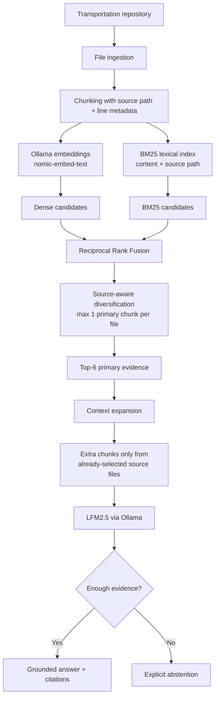

# Transportation Research Assistant

A fully local, evaluated Retrieval-Augmented Generation (RAG) assistant for exploring a transportation-simulation codebase.

The project indexes the [`porto-route-simulation`](https://github.com/billysuryono1412-code/porto-route-simulation) repository and answers technical questions about preprocessing, simulation configuration, routing logic, evaluation metrics, and implementation details with source citations.

The system runs locally with **Ollama**, uses **hybrid dense + BM25 retrieval**, applies **Reciprocal Rank Fusion (RRF)** and source-aware diversification, expands context only from already-selected source files, and explicitly abstains when the indexed evidence is insufficient.

---

## Highlights

- Fully local inference with **LFM2.5 via Ollama**
- Local embeddings with **`nomic-embed-text`**
- Dense semantic retrieval + dependency-free **BM25**
- Fielded lexical scoring over both chunk text and source paths
- **Reciprocal Rank Fusion**
- Source-aware retrieval diversification
- Source-constrained context expansion for generation
- Inline source citations such as `[S1]`
- Explicit abstention for unsupported questions
- Retrieval, abstention, citation, latency, and expected-fact evaluation
- Development/held-out benchmark separation
- An LLM reranker was tested and **rejected after showing no measurable retrieval improvement**

---

## Why this project?

Many RAG demos stop after showing that a model can answer a few questions from documents.

This project instead treats RAG as an evaluated information-retrieval system.

The goal was to answer questions such as:

- How is background congestion inferred?
- Which file controls a rerouting threshold?
- How does route learning work?
- What makes a simulated route match an observed route?
- How are candidate routes loaded and repaired?
- What configuration produced the reported experiment?
- When should the system refuse to answer?

The emphasis is not only on generating plausible text, but on verifying whether the correct source was retrieved, whether the answer was supported, whether citations were valid, and whether the system knew when to abstain.

---

## System Architecture



### Final retrieval configuration

| Setting | Final value |
|---|---:|
| Source-path BM25 weight | `1.0` |
| Hybrid candidate count | `10` |
| RRF constant | `20` |
| Primary chunks per source | `1` |
| Primary context | Top `6` chunks |
| Expanded generation context | Up to `10` chunks |
| Embedding model | `nomic-embed-text` |
| Generation model | `lfm2.5` |
| Runtime | Ollama |

The source-diversification step operates on primary retrieval so one file cannot crowd out all other evidence. Context expansion is then allowed to retrieve additional chunks **only from source files that primary retrieval already selected**.

This separates two concerns:

1. **retrieval diversity** — expose the model to multiple relevant files;
2. **within-file context** — provide enough code/document context for the generator to answer accurately.

---

## Retrieval Pipeline

### 1. Dense retrieval

Each indexed chunk is embedded locally with `nomic-embed-text`.

The embedding matrix is stored locally and searched with cosine similarity.

### 2. BM25 lexical retrieval

A local BM25 implementation complements semantic retrieval.

Lexical scoring uses two fields:

- chunk content;
- source path.

Source-path scoring is useful for technical questions containing identifiers such as `SweepConfig`, `SimulationEngine`, or a specific script name.

### 3. Reciprocal Rank Fusion

Dense and BM25 candidates are merged with Reciprocal Rank Fusion:

\[
\mathrm{RRF}(d)=\sum_r \frac{1}{k+\mathrm{rank}_r(d)}
\]

The final tuned RRF constant is `20`.

### 4. Source-aware diversification

After fusion, the primary result list keeps at most one chunk per source file.

This prevents repeated chunks from the same file from occupying most of the context window.

### 5. Source-constrained context expansion

Aggressive diversification improved retrieval coverage but initially caused a new failure mode: the correct **file** was retrieved, but one chunk from that file was sometimes insufficient for generation.

V2.3 therefore expands the generation context after primary retrieval.

Additional chunks can only come from files that were already selected by the retriever. This provides more within-file evidence without introducing unrelated sources.

---

## Grounded Generation

The generator receives retrieved evidence with source IDs:

```text
[S1] simulation/src/main/java/porto/sweep/sim/SimulationEngine.java:...
...

[S2] simulation/README.md:...
...
```

The model is instructed to answer from the supplied evidence and cite supporting sources.

When evidence is insufficient, the assistant returns the fixed abstention response:

```text
I don't have enough evidence in the indexed sources to answer that reliably.
```

This behavior is evaluated explicitly rather than treated as an informal prompt preference.

---

## Evaluation Design

Two separate 50-question benchmarks were used.

### Development benchmark

The development benchmark contains:

- **40 answerable questions**
- **10 deliberately unanswerable questions**

It was used for:

- diagnosing retrieval failures;
- tuning hybrid retrieval;
- testing source diversification;
- evaluating context expansion;
- improving evaluator robustness.

A 216-configuration retrieval sweep explored combinations of:

- source-path BM25 weight;
- candidate pool size;
- RRF constant;
- per-source chunk cap.

Because this set was used for tuning, it is reported as a **development benchmark**, not as the final test result.

### Held-out benchmark

A second 50-question benchmark was constructed **after the V2.3 architecture and retrieval configuration were frozen**.

It also contains:

- **40 answerable questions**
- **10 unanswerable questions**

The held-out set tests different details from the same Porto simulation repository, including:

- preprocessing controls and failure behavior;
- CSV loading and parsing;
- route-learning logic;
- repository loader fallbacks;
- LHS experiment construction;
- taxi-class assignment;
- reroute cooldown semantics;
- parameter validation;
- unsupported domain questions that should trigger abstention.

No retrieval, prompt, context, or generation tuning was performed against the held-out results.

---

## Metrics

### Retrieval

**Recall@K**

Whether at least one gold source file appears in the top `K` retrieved sources.

**MRR — Mean Reciprocal Rank**

\[
\mathrm{MRR} =
\frac{1}{N}
\sum_{i=1}^{N}
\frac{1}{\mathrm{rank}_i}
\]

A higher MRR means the correct source tends to appear earlier.

### Generation

**Abstention accuracy**

Whether the system correctly decides to answer answerable questions and abstain from unsupported ones.

**Citation validity**

Whether source IDs cited by the generated answer correspond to source IDs actually provided in context.

**Expected-fact coverage**

Each answerable benchmark item includes a list of expected facts. A local Ollama judge checks whether each fact is substantively present in the generated answer.

This metric is reported as **local-judge expected-fact coverage**, not as independent human accuracy.

Answerable abstentions receive zero fact coverage.

The judge is run at temperature `0` and supports:

- exact per-fact Boolean lists;
- normalized alternative JSON formats;
- retry on malformed batch output;
- per-fact judging fallback when batch grading remains ambiguous.

### Latency

Wall-clock answer latency is measured for local generation. Judge time is not included in the answer latency metric.

---

## Results

### System evolution on the development benchmark

| Version | Retrieval design | Recall@1 | Recall@3 | Recall@5 | MRR | Abstention accuracy |
|---|---|---:|---:|---:|---:|---:|
| V1 | Dense semantic retrieval | 57.5% | 72.5% | 85.0% | 0.676 | 78% |
| V2 | Dense + BM25 + RRF | 65.0% | 92.5% | 92.5% | 0.779 | 86% |
| V2.2 | Tuned hybrid retrieval | 67.5% | 92.5% | 95.0% | 0.810 | 82% |
| **V2.3** | Tuned hybrid + source-constrained context expansion | **67.5%** | **92.5%** | **95.0%** | **0.810** | **94%** |

Final V2.3 development result:

| Metric | Result |
|---|---:|
| Recall@1 | 67.5% |
| Recall@3 | 92.5% |
| Recall@5 | 95.0% |
| MRR | 0.8104 |
| Abstention accuracy | 94.0% |
| Citation validity | 100% |
| Local-judge expected-fact coverage | 88.13% |
| Mean answer latency | 6.76 s |

### Final held-out result

The frozen V2.3 system was then evaluated on the separate held-out benchmark.

| Metric | Held-out result |
|---|---:|
| **Recall@1** | **77.5%** |
| **Recall@3** | **95.0%** |
| **Recall@5** | **100.0%** |
| **MRR** | **0.8708** |
| **Abstention accuracy** | **98.0%** |
| **Citation validity** | **100.0%** |
| **Local-judge expected-fact coverage** | **96.04%** |
| Mean answer latency | 8.50 s |

For the 40 answerable held-out questions:

```text
Gold source at rank 1      31 / 40
Gold source within top 3   38 / 40
Gold source within top 5   40 / 40
```

For abstention behavior:

```text
40 answerable
├── 39 answered
└── 1 false abstention

10 unanswerable
└── 10 correctly abstained

Overall abstention accuracy: 49 / 50 = 98%
```

Because the one answerable abstention receives zero fact coverage, the reported 96.04% expected-fact coverage is stricter than measuring only the 39 generated answers.

---

## Ablation and Iteration History

### V1 — Dense baseline

The first system used only dense embedding retrieval.

Development results:

```text
Recall@1  57.5%
Recall@3  72.5%
Recall@5  85.0%
MRR       0.676
```

This established a baseline but left six answerable development questions without their gold source in the top five.

### V2 — Hybrid retrieval

BM25 and Reciprocal Rank Fusion were added.

```text
Recall@1  65.0%
Recall@3  92.5%
Recall@5  92.5%
MRR       0.779
```

The largest gain was at Recall@3: **+20 percentage points** over V1.

### LLM reranker experiment — rejected

A local LFM2.5 reranker was tested after hybrid retrieval.

Diagnostics showed:

```text
Questions whose order changed: 10 / 50
Gold-source rank improved:      0
Gold-source rank worsened:      0
Gold entered top-K:             0
Gold left top-K:                0
```

Retrieval metrics were exactly unchanged.

The reranker therefore added latency and complexity without measurable benefit and was removed.

This negative result was retained as part of the experimental record.

### Metadata-aware BM25 + diversification

Failure analysis showed that duplicate chunks from the same source frequently crowded the top retrieval positions.

Source-path lexical scoring and source-aware diversification increased source coverage, but aggressively limiting each source to one chunk sometimes deprived the generator of enough local code context.

### V2.3 — separate retrieval diversity from generation context

The final design retained diversified primary retrieval but expanded context within already-selected files before generation.

This improved abstention behavior without changing the tuned retrieval rankings.

---

## Important Engineering Findings

### Hybrid retrieval substantially outperformed dense-only retrieval

The largest improvement came from combining semantic and lexical signals rather than from adding another LLM stage.

### File-level retrieval and answer context are different problems

A retriever can correctly find `SimulationEngine.java` while still selecting the wrong or insufficient chunk from that file.

Primary source diversity and generation-context expansion therefore need to be treated separately.

### More LLMs do not automatically improve RAG

The local LFM2.5 reranker changed some rankings but produced **zero improvement** in Recall or MRR.

Removing it produced a simpler and more evidence-based architecture.

### Evaluation changed the architecture

Several system changes were motivated directly by measured failures:

```text
Duplicate chunks crowd top-K
        ↓
source diversification

Correct file but insufficient local context
        ↓
source-constrained context expansion

Judge JSON formatting inconsistencies
        ↓
robust normalization + retry + per-fact fallback
```

---

## Running Locally

### Requirements

- Python
- Ollama
- Local copy of the `porto-route-simulation` repository

Pull the models:

```powershell
ollama pull lfm2.5
ollama pull nomic-embed-text
```

Typical environment configuration:

```text
TRA_EMBED_MODEL=nomic-embed-text
TRA_OLLAMA_URL=http://localhost:11434
TRA_OLLAMA_MODEL=lfm2.5
TRA_TOP_K=6
TRA_MIN_SCORE=0.20
TRA_INDEX_DIR=.rag_index
```

### Build the index

From the RAG project:

```powershell
python -m transport_rag.ingestion.cli --source ..\porto-route-simulation --index .rag_index
```

The index is persisted locally. It only needs to be rebuilt when the indexed corpus, chunking logic, or embedding model changes.

### Ask a question

```powershell
python -m transport_rag.ask_cli "How is background congestion inferred?"
```

---

## Evaluation

### Retrieval-only evaluation

```powershell
python -m transport_rag.evaluation.run_eval --mode retrieval --retriever hybrid
```

### Full development evaluation

```powershell
python -m transport_rag.evaluation.run_eval --mode full --retriever hybrid --judge
```

### Held-out evaluation

```powershell
python -m transport_rag.evaluation.run_eval --questions evals/heldout_questions.jsonl --mode full --retriever hybrid --judge
```

### Retrieval parameter sweep

```powershell
python -m transport_rag.evaluation.tune_retrieval
```

The development sweep tested 216 retrieval configurations.

The final system should **not** be tuned against the held-out benchmark.

---

## Evaluation Data Format

Each JSONL benchmark item contains:

```json
{
  "id": "h001",
  "category": "preprocessing",
  "difficulty": "medium",
  "answerable": true,
  "question": "Example question?",
  "gold_sources": [
    "preprocessing/README.md"
  ],
  "expected_facts": [
    "Expected fact one.",
    "Expected fact two."
  ]
}
```

Unanswerable items contain empty `gold_sources` and `expected_facts`.

---

## Repository Structure

A typical project layout is:

```text
transport-research-assistant/
├── src/
│   └── transport_rag/
│       ├── config.py
│       ├── rag.py
│       ├── ask_cli.py
│       ├── generation/
│       │   └── ollama.py
│       ├── ingestion/
│       │   └── cli.py
│       ├── retrieval/
│       │   ├── index.py
│       │   └── rerank.py
│       └── evaluation/
│           ├── run_eval.py
│           └── tune_retrieval.py
├── evals/
│   ├── questions.jsonl
│   ├── heldout_questions.jsonl
│   └── results/
├── tests/
├── .env.example
└── README.md
```

---

## Limitations

The final results should be interpreted within the scope of this project.

- The development and held-out benchmarks cover **new questions over the same Porto simulation repository**. They do not demonstrate generalization to arbitrary repositories or domains.
- Expected-fact coverage is graded by the configured **local Ollama model**, not by an independent human evaluator.
- File-level Recall@K considers a retrieval successful when a gold **source file** appears in the top results; it does not require the exact gold chunk to be ranked.
- The held-out set is manually constructed from the repository and may differ in difficulty from the development set.
- The assistant depends on the indexed repository being internally correct and sufficiently documented.
- Local-model latency depends on hardware, model configuration, answer length, and concurrent system load.

The held-out benchmark scored higher than the development benchmark. This should not be interpreted as evidence of improvement after freezing; the two sets contain different questions and difficulty distributions.

---

## Reproducibility Principles

The experiment follows several rules intended to reduce evaluation leakage:

1. Use the original 50-question set as a development benchmark.
2. Tune retrieval only on the development set.
3. Freeze V2.3 before constructing the held-out benchmark.
4. Evaluate the held-out benchmark without changing the architecture.
5. Report the held-out result as obtained rather than tuning against individual failures.
6. Keep rejected experiments, such as the LLM reranker, in the experimental record.

---

## Portfolio Summary

> Built a fully local evaluated RAG system over a transportation-simulation codebase using Ollama, hybrid dense/BM25 retrieval, reciprocal-rank fusion, source-aware diversification, and evidence-context expansion. After tuning on a separate 50-question development benchmark, the frozen system achieved **100% Recall@5, 0.871 MRR, 98% abstention accuracy, 100% citation validity, and 96.0% local-judge expected-fact coverage** on a 50-question held-out benchmark. An LLM reranker was evaluated and rejected after providing no measurable retrieval improvement.

---

## Related Project

The indexed transportation codebase is:

[`porto-route-simulation`](https://github.com/billysuryono1412-code/porto-route-simulation)

It contains the Porto taxi preprocessing pipeline and Java route-choice/rerouting simulation used as the knowledge base for this assistant.
